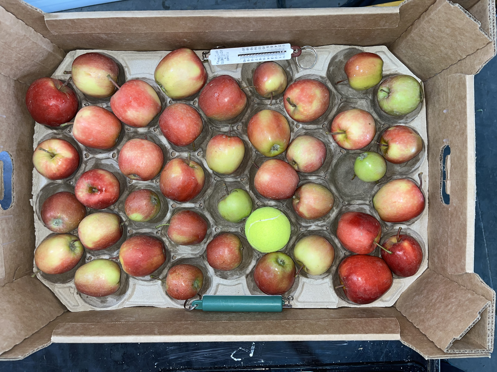
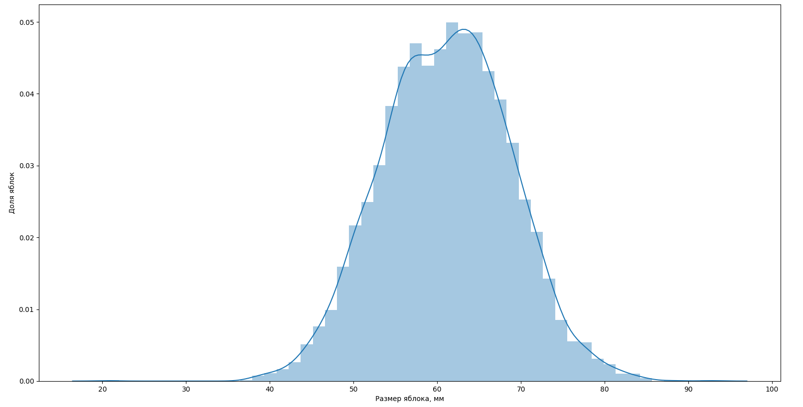

# Оценка диаметра яблок
### Постановка задачи
Задумка - создать средство объективного контроля приобретаемого товара со стороны заказчика. 
Одной из подзадач является определение диаметра каждого яблока в ящике по фото. Предполагается использовать сегментирующую нейросеть YOLO, которая будет определять максимальный видимый диаметр в пикселях, затем соотносить размером известного предмета и получать размер в миллиметрах. 

Нами было отснято и взвешено более 600кг яблок (+-6300 плодов на 488 снимках в трех проекциях) по партиям в размере 39-44шт вместе с калибровочными предметами, размер которых известен (теннисный мяч и кантор).

Необходимо определить диаметр каждого яблока на изображениях в различных проекциях с помощью нейросети, получить картину распределения. 

Есть возможность сравнить наши результаты с результатами  профессионального оборудования.

### План проекта:
1. Создание фото в количестве 488шт.
2. структурирование фото по партиям.
3. Удаление выбросов и некачественных данных.
4. Разметка датасета.
5. Обучение сегментирующей нейросети YOLO.
6. Прогон снимков через нейросеть.
7. Ручная или автоматическая обработка выбросов, полученных при работе модели.
8. Построение модели, учитывающей данные с различных снимков.
9. Построение алгоритма, сопоставляющего линейный размер яблок и калибровочных предметов.
10. Создание системы предобработки снимков, коррекции искажений линзы.
11. Уточнение контуров с помощью более низкоуровневых методов машинного зрения.
12. Предсказание максимального диаметра каждого яблока в мм.
13. Построение гистограммы распределения диаметров яблок.
14. Попытка оценить вес партии, используя известные данные по взвешиванию.
15. Сравнение с профессиональным оборудованием.

Возможно, для уточнения контура будут использованы более низкоуровневые методы сегментации в связке с YOLO как классификатором

### Входные данные:

### Выходные данные:
![[Media/IMG_4470.jpg]]

| Калибр № | Кол-во, шт | Вес, кг |
| -------- | ---------- | ------- |
| 1        | N          | n       |
| 2        | M          | m       |
| 3        | K          | k       |

### Итоговая гистограмма

# Распределение обязанностей
#### Лагутин Илья:
- Съемка яблок.
- Разметка датасета.
- Обучение сегментирующей нейросети.
- Алгоритм вычисления диаметра объектов и сопоставляющий известным.
- Создание системы предобработки снимков, коррекции искажений линзы.
- Уточнение контуров объектов.

#### Павленко Елизавета:
- Структурирование фото по партиям.
- Удаление выбросов.
- Ручная или автоматическая обработка выбросов, полученных при работе модели.
- Построение модели, учитывающей данные с различных снимков внутри одной партии (разные проекции).
- Построение гистограммы распределения диаметров яблок.
- Разделение на калибры ("сортность").

